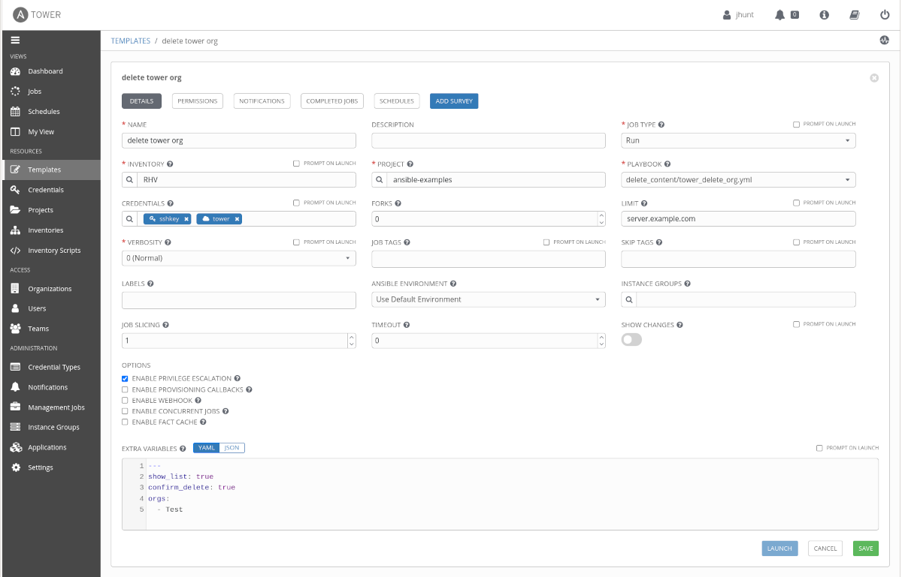

# Delete Ansible Tower Organizations

This playbook will help you delete Ansible Tower Organizations and all their artifacts.

> **WARNING:** This playbook **will** delete content from your Ansible Tower. It is recommended
> that you take a backup of your Tower environment before you proceed. Test by submitting
> one Organization for deletion rather than a list. You can run the playbook to view
> the contents of what will be deleted before acutally deleting the content.

First create a new credential, set the **CREDENTIAL TYPE** to _Ansible Tower_. Then
enter in the Tower Hostname, Tower Username, and Tower Oauth Token.

Next create a new Job Template that will use this playbook in the project you have
setup for access. In the **CREDENTIALS** field make sure to include your _Machine_
credential to access your inventory and the _Ansible Tower_ credential you just created.



You will also want to set a **LIMIT** of one host, since you only need the
job template to run once.

In the Job Template section, **EXTRA VARIABLES** you will need to define a _list_
variable named _orgs_, which contains the list of Organizations that you want to
delete.

By default the playbook will show you the content that will be deleted, but it will
not actually delete the content. When you are ready to delete the content set the
variable _confirm_delete_ to _true_.

```yaml
---
show_list: true
confirm_delete: true
orgs:
  - Test
```

If you do not wish to view the list of artifacts to be deleted you can set _show_list_
to _false_.

This playbook will delete the Organization and the following artifacts associated
with that Organization.

- Users
- Teams
- Applications
- Workflows
- Job Templates
- Inventories
- Projects
- Credentials
